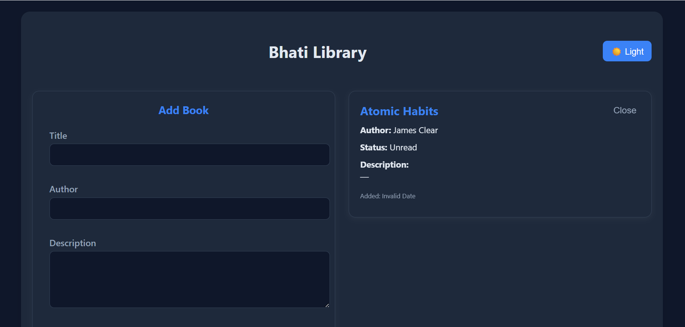
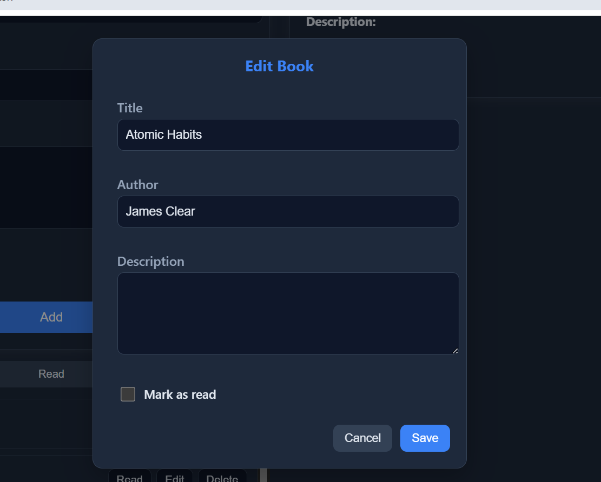
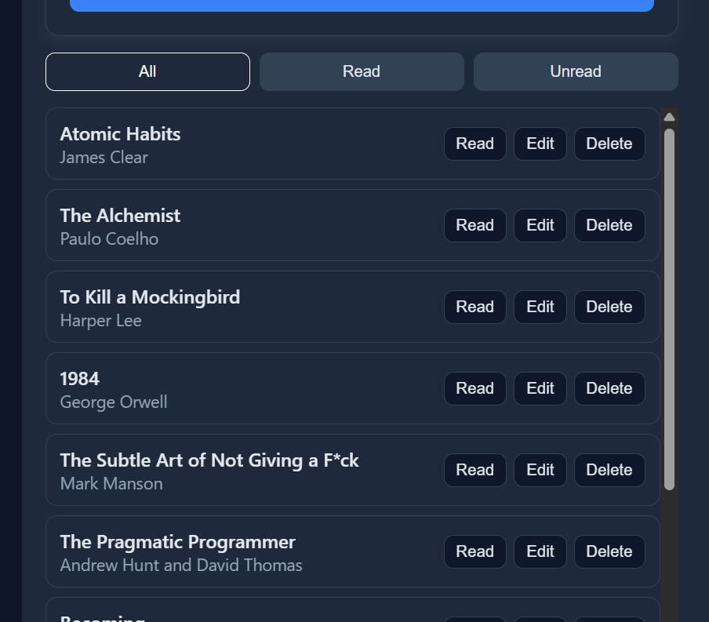

# 📚 My Book Library

A modern **React + Redux Toolkit** application to manage your personal book collection — add, edit, filter, and mark books as read or unread.  
The app is fully responsive, theme-aware (Light/Dark mode), and persists data using **localStorage**.

---

## 🚀 Features

✅ **Add Books** — Add new books with title, author, and description.  
✏️ **Edit Books** — Update details easily through a sleek modal popup.  
👀 **View Details** — Click a book to view full information.  
📘 **Mark Read/Unread** — Quickly toggle reading status.  
🔍 **Filter** — Show all, only read, or unread books.  
🌓 **Dark / Light Mode** — Saves theme preference automatically.  
💾 **Persistent Data** — Stored in `localStorage` (no backend needed).  
🎨 **Custom Styling** — Clean, minimal UI built with separate CSS files.  
📱 **Fully Responsive** — Works beautifully on desktop, tablet, and mobile.  

---

## 🛠️ Tech Stack

| Tool | Purpose |
|------|----------|
| ⚛️ React | Frontend framework |
| 🧰 Redux Toolkit | State management |
| 🎨 CSS | Custom modular styles |
| 💾 localStorage | Data & theme persistence |

---

## 📁 Folder Structure
book-library/
├── src/
│   ├── app/
│   │   └── store.js
│   ├── components/
│   │   ├── BookForm.js
│   │   ├── BookList.js
│   │   ├── BookDetails.js
│   │   └── EditModal.js
│   ├── features/
│   │   └── books/
│   │       ├── booksSlice.js
│   ├── styles/
│   │   ├── App.css
│   │   ├── BookForm.css
│   │   ├── BookItem.css
│   │   ├── BookDetails.css
│   │   └── EditModal.css
│   ├── App.js
│   └── index.js
├── package.json
└── README.md

# UI Overview
Section	Description
Add Book	- Add new books and mark them as read/unread
Book List	- Displays all books with edit/delete options
Book Details- Shows detailed info when a book is selected
Edit Modal	- Update book details in a popup
Filters	    - Show all / read / unread books
Dark Mode   - Switch themes with a single click

## ⚙️ How to Run Locally

```bash
# 1️⃣ Create a new React app
# npx create-react-app book-library

# 2️⃣ Move into the project directory
cd book-library

# 3️⃣ Install dependencies
npm install

# 4️⃣ Start the development server
npm start


---


# 🌍 Live Demo at Surge : https://romantic-point.surge.sh


## 🖼️ Screenshots

### ➕ Add Book Form


### ✏️ Edit Book Modal


### 🌓 All Books


> 📸 _All screenshots are from the responsive production build._

---

